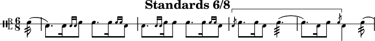

# Lilydrum (pipeband-drumming notation)

[Lilypond](http://lilypond.org) does not cover drum notation for pipebands out of the box.
That is, right is above the line and left is below it. \
In the same manner as the bagpipe.ly file included with Lilypond, this library allows to easily use this notation with opt-in elements.
See the [cheatsheet](./cheatsheet.pdf) ([ly](./cheatsheet.ly), [pdf](./cheatsheet.pdf)) for a handful of definitions.

 \
*(see [./example.ly](./example.ly) for fully annotated code and its [score](./example.pdf))*

There has been such a Lilypond include file earlier, made by Simon Froger. This repository builds on his work.
The ~~original~~ (updated) file can be found at [http://lsr.di.unimi.it/LSR/Snippet?id=970](http://lsr.di.unimi.it/LSR/Snippet?id=970).

[His website (French) can be found here](https://simonfroger.wordpress.com/lilypond/caisse-claire-ecossaise/)

This repository has also been converted into a [lyp](https://github.com/noteflakes/lyp) package: [lyp/lilydrum](https://github.com/lyp-packages/lilydrum).

*shameless plug:* \
An example of scores typeset with this library can be found in
 [kastdeur/pipeband-music](https://github.com/kastdeur/pipeband-music)
 or
 [on my website (pdf)](https://deboone.nl/scores/pipeband).

## How to use
Add the following line to include the definitions for use in your document:
```lilypond
\include "[path]/lilydrum.ly"
```

The music needs to be defined in a `\drummode` environment.
You can get this in two ways:
```lilypond
\new DrumStaff {
	\drummode {
		[music]
	}
}
```
or (simply)
```lilypond
\drums {
	  [music]
}
```

### Music
In pipeband music there is a distinction between left-hand and right-hand strokes.
To implement this in your music you can use the `d` and `g` notenames.
* `d`: (*droite*) right hand
* `g`: (*gauche*)  left hand

*You can still use the regular drumcharacters (such as `sn` or `bd`) in your music.*

### Pipeband DrumStaff
To make a pipeband drumstaff (a `DrumStaff` with a few specific changes) you can use
```lilypond
\new PipeBandDrumStaff
```
*You do not need to use PipeBandDrumStaff to use the music definitions.*


### Embellishments (Side Drum)
Flams and Drags can be added using `\flam` and `\drag`.
They can determine whether to be left or right by themselves for simple expressions.

If a certain hand is needed they can be inserted directly by appending `d` or `g` to `flam`,`drag`,..
e.g. a `\flam d` is equal to `\flamd d`.

There are currently 4 such shortcuts:
 * `\flam` - A Flam
 * `\drag` - A Drag
 * `\ruff` - A Ruff
 * `\sruff` - A Swiss Ruff


### Unison Brackets (Side Drum)
Unison Brackets are triggered using `\dr`.
They need an endpoint which is defined by `\fr`.

You can use `\tutti` for this aswell.
It takes a music expression which is automagically put under brackets.

Appending `dr` to the `\flam`'s  or `\drag`'s triggers the unison bracket.
e.g. `\flamdr` or `\draggdr`.


### Flourishing (Tenor Drum)

A few flourishes have been added, most are from the [EUSPBA](http://www.euspba.org/resource/music/EUSPBA_drums_tenorflourishing.pdf):
 * `\flourish`
 * `\splitTheFeather`
 * `\cartWheel`
 * `\up`
 * `\rswipe`
 * `\blfy`   - butterfly
 * `\rblfy`  - reverse butterfly
 * `\rthrow` - throw right
 * `\lthrow` - throw left
 * `\bthrow` - throw both
 * `\rpush`  - push right
 * `\lpush`  - push left
 * `\bpush`  - push both
 * `\andrewStop` - St. Andrew's Stop
 * `\stop`


Scoops have not been implemented correctly yet. (see [GitHub Issue #4](https://github.com/kastdeur/lilydrum/issues/4))
